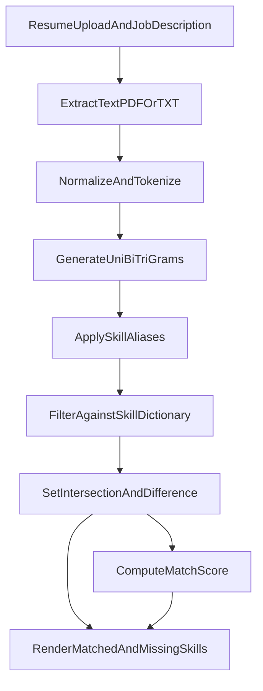

# AI Resume Analyzer & Job Matcher

Match your resume against a job description in seconds and get a realistic, skill-focused fit score with actionable gap analysis.

## Why This Project

Job descriptions include lots of generic language ("build", "collaborate", "seeking"), which can distort naive keyword matching. This app solves that by using a curated **Skill Dictionary** and **Skill Aliases** to score only recognized technical skills.

## What This Project Is

This is a **single-page web app** built with Streamlit (not a CLI, not a backend API service).

- Input: Resume (`.pdf` or `.txt`) + job description text
- Output: Match score, matching skills, and missing skills

## Visuals

[Watch the Demo Video](https://drive.google.com/file/d/1xlOKZvszi9XD9PB9TsKZAdYwLCRIX_R7/view?usp=sharing)


## Key Features

- Skill-aware matching using a hardcoded `SKILL_DICTIONARY` (avoids generic-word noise).
- Alias normalization via `SKILL_ALIASES` (`react.js` -> `react`, `k8s` -> `kubernetes`, etc.).
- N-gram extraction (uni/bi/tri-gram) for multi-word skills like `machine learning`.
- PDF and TXT resume ingestion with robust decoding/parsing paths.
- Button-triggered analysis only (no auto-analysis on typing/upload change).
- Resume processing cache using Streamlit session state + SHA-256 file hash.
- Clear dashboard output with:
  - Match score metric
  - Matching skills (green)
  - Missing skills (yellow)

## Tech Stack

- **Language:** Python 3.10+ (recommended: Python 3.11)
- **UI Framework:** Streamlit
- **NLP Utilities:** NLTK (`punkt`, `stopwords` resources)
- **Document Parsing:** PyPDF2
- **Standard Library:** `hashlib`, `io`, `re`

## Getting Started

### Prerequisites

- Python 3.10 or newer (`python3 --version`)
- `pip` for package installation
- Internet access on first run to download NLTK resources (`punkt`, `stopwords`)

No external API keys are required for the current implementation.

### Installation

```bash
git clone https://github.com/username/ResumeAnalyzer-Python.git
cd ResumeAnalyzer-Python
python3 -m venv .venv
source .venv/bin/activate
pip install --upgrade pip
pip install -r requirements.txt
```

### Environment Configuration

This project currently does **not** require a `.env` file.

Optional Streamlit environment variables (only if you need custom runtime behavior):

- `STREAMLIT_SERVER_PORT` - Set a custom port
- `STREAMLIT_SERVER_ADDRESS` - Bind host address
- `STREAMLIT_BROWSER_GATHER_USAGE_STATS` - Disable usage telemetry if needed

Example:

```bash
export STREAMLIT_SERVER_PORT=8501
streamlit run app.py
```

## Usage Examples

### Quick Start

```bash
streamlit run app.py
```

Then in the browser UI:
1. Upload a resume (`.pdf` or `.txt`)
2. Paste a job description
3. Click **Analyze Match**

### Common Local Run Flow

```bash
cd ResumeAnalyzer-Python
source .venv/bin/activate
streamlit run app.py
```

## Architecture & Data Flow

High-level flow in `app.py`:

1. User uploads resume and pastes JD in Streamlit UI.
2. Resume text is extracted from PDF/TXT.
3. Text is normalized and tokenized.
4. Candidate uni/bi/tri-grams are generated.
5. Candidates are normalized through `SKILL_ALIASES`.
6. Skills are filtered against `SKILL_DICTIONARY`.
7. Set operations compute matched and missing skills.
8. Score is calculated and rendered.



## API / Code Reference

This project is UI-driven, but these are the main internal functions in `app.py`:

- `ensure_nltk_data()`  
  Ensures required NLTK resources exist (`punkt`, `stopwords`).

- `extract_resume_text(file_name, file_bytes)`  
  Dispatches resume parsing by file type (`.pdf` or `.txt`).

- `extract_skills(text)`  
  Converts free text into normalized skill keys recognized by `SKILL_DICTIONARY`.

- `compute_match(resume_skills, job_skills)`  
  Returns `(matched_skills, missing_skills, score)`.

- `render_results(score, matched_skills, missing_skills)`  
  Displays Streamlit metric and skill bullet lists.

### Inputs and Outputs

- **Input:** Uploaded file + job description string
- **Output:** UI dashboard containing:
  - `%` match score
  - matching skills list
  - missing skills list

## Development & Testing

### Run Local Checks

```bash
python3 -m py_compile app.py
```

### Optional Linting

If you use a linter locally (recommended):

```bash
ruff check app.py
```

### Contribution Workflow

- Use short-lived feature branches from `main` (trunk-based style).
- Keep PRs focused and small.
- Validate syntax before opening PRs.

## Roadmap

- Add downloadable analysis report (PDF/Markdown export).
- Add configurable skill profiles by role (Data Scientist, Backend, DevOps, etc.).
- Add weighted scoring by required vs preferred skills.
- Add automated tests for extraction and matching helpers.
- Add sample resumes/JDs for reproducible demo cases.

## Known Issues

- PDF text extraction quality depends on PDF structure (scanned/image-based PDFs may fail).
- Skill detection is dictionary-driven; unseen skills require dictionary updates.
- NLTK resources are downloaded at first run if missing, which needs network access.
- Match quality depends on how well the JD wording maps to dictionary aliases.

## Formula

`Match Score = (Number of Matched Job Skills / Total Job Skills) * 100`

If no recognized skills are found in the job description, score is `0.0%` and a warning is shown.
